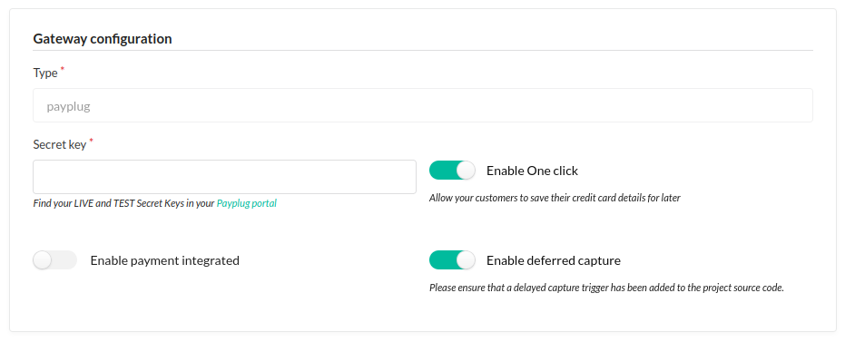

# Authorized Payment

This feature allow merchant to deferred the capture of the payment. 
The payment is authorized and the capture can be done later.

> [!IMPORTANT]
> The authorized payment feature is only available for the "PayPlug" payment gateway.

## Activation

On the payment method configuration, you can enable the deferred catpure feature.



## Trigger the capture

### Periodically

An authorized payment is valid for 7 days.
You can trigger the capture of the authorized payment by running the following command:

```bash
$ bin/console payplug:capture-authorized-payments --days=6
```

It will capture all authorized payments that are older than 6 days.

> [!TIP]
> You can add this command to a cron job to automate the capture of the authorized payments.

### Programmatically

An authorized payment is in state `AUTHORIZED`. 
A capture trigger is placed on the complete transition for such payments.

```yaml
winzou_state_machine:
    sylius_payment:
        callbacks:
            before:
                payplug_sylius_payplug_plugin_complete:
                    on: ["complete"]
                    do: ["@payplug_sylius_payplug_plugin.payment_processing.capture", "process"]
                    args: ["object"]
```
> [!NOTE]
> This configuration is already added by the plugin.

For example, if you want to trigger the capture when an order is shipped, you can create a callback on the `sylius_order_shipping` state machine.

```yaml 
winzou_state_machine:
    sylius_order_shipping:
        callbacks:
            before:
                app_ensure_capture_payment:
                    on: ["ship"]
                    do: ['@App\StateMachine\CaptureOrderProcessor', "process"]
                    args: ["object"]
```

```php
<?php

declare(strict_types=1);

namespace App\StateMachine;

use SM\Factory\Factory;
use Sylius\Component\Core\Model\OrderInterface;
use Sylius\Component\Core\Model\PaymentInterface;
use Sylius\Component\Payment\PaymentTransitions;
use Symfony\Component\DependencyInjection\Attribute\Autoconfigure;

#[Autoconfigure(public: true)] // make the service public to be callable by winzou_state_machine
class CaptureOrderProcessor
{
    public function __construct(private Factory $stateMachineFactory) {}
    
    public function process(OrderInterface $order): void
    {
        $payment = $order->getLastPayment(PaymentInterface::STATE_AUTHORIZED);
        if (null === $payment) {
            // No payment in authorized state, nothing to do here
            return;
        }

        $this->stateMachineFactory
            ->get($payment, PaymentTransitions::GRAPH)
            ->apply(PaymentTransitions::TRANSITION_COMPLETE);

        if (PaymentInterface::STATE_COMPLETED !== $payment->getState()) {
            throw new \LogicException('Oh no! Payment capture failed 💸');
        }
    }
}
```
