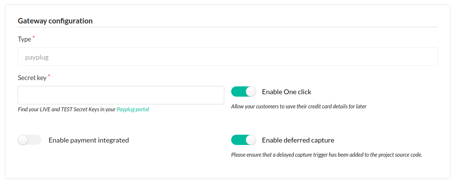

# Authorized Payment

This feature allow merchant to deferred the capture of the payment. 
The payment is authorized and the capture can be done later.

> [!IMPORTANT]
> The authorized payment feature is only available for the "PayPlug" payment gateway.

Two flows exist, depending on the payment method's display mode:

- **Hosted Fields** (Unified API): capture — full, partial, several times — and cancellation are
  driven from the admin order screen. See [Hosted Fields: capture and cancel from the order screen](#hosted-fields-capture-and-cancel-from-the-order-screen).
- **Redirected / Integrated Payment** (legacy API): the whole authorized amount is captured at
  once, by the command or the state machine triggers described in [Trigger the capture](#trigger-the-capture).

## Activation

On the payment method configuration, you can enable the deferred capture feature.



## Trigger the capture

### Periodically

An authorized payment is valid for 7 days.
You can trigger the capture of the authorized payment by running the following command:

```bash
$ bin/console payplug:capture-authorized-payments --days=6
```

It will capture all authorized payments that are older than 6 days.

> [!TIP]
> You can add this command to a cron job to automate the capture of the authorized payments.

### Programmatically

An authorized payment is in state `AUTHORIZED`. 
A capture trigger is placed on the complete transition for such payments.

```yaml
winzou_state_machine:
    sylius_payment:
        callbacks:
            before:
                payplug_sylius_payplug_plugin_complete:
                    on: ["complete"]
                    do: ["@payplug_sylius_payplug_plugin.payment_processing.capture", "process"]
                    args: ["object"]
```
> [!NOTE]
> This configuration is already added by the plugin.

### With Winzou State Machine

For example, if you want to trigger the capture when an order is shipped, you can create a callback on the `sylius_order_shipping` state machine.

File: `config/packages/winzou_state_machine.yaml`

```yaml 
winzou_state_machine:
    sylius_order_shipping:
        callbacks:
            before:
                app_ensure_capture_payment:
                    on: ["ship"]
                    do: ['@App\StateMachine\CaptureOrderProcessor', "process"]
                    args: ["object"]
```

File : `src/StateMachine/CaptureOrderProcessor.php`

```php
<?php

declare(strict_types=1);

namespace App\StateMachine;

use SM\Factory\Factory;
use Sylius\Component\Core\Model\OrderInterface;
use Sylius\Component\Core\Model\PaymentInterface;
use Sylius\Component\Payment\PaymentTransitions;
use Symfony\Component\DependencyInjection\Attribute\Autoconfigure;

#[Autoconfigure(public: true)] // make the service public to be callable by winzou_state_machine
class CaptureOrderProcessor
{
    public function __construct(private Factory $stateMachineFactory) {}
    
    public function process(OrderInterface $order): void
    {
        $payment = $order->getLastPayment(PaymentInterface::STATE_AUTHORIZED);
        if (null === $payment) {
            // No payment in authorized state, nothing to do here
            return;
        }

        $this->stateMachineFactory
            ->get($payment, PaymentTransitions::GRAPH)
            ->apply(PaymentTransitions::TRANSITION_COMPLETE);

        if (PaymentInterface::STATE_COMPLETED !== $payment->getState()) {
            throw new \LogicException('Oh no! Payment capture failed 💸');
        }
    }
}
```

### With Symfony Workflow (default in Sylius 2)

If you are using Symfony Workflow, you can create a custom action to capture the payment, with a transition listener.

File: `src/StateMachine/CaptureOrderProcessor.php`

```php
<?php

declare(strict_types=1);

namespace App\StateMachine;

use Sylius\Abstraction\StateMachine\StateMachineInterface;
use Sylius\Component\Core\Model\OrderInterface;
use Sylius\Component\Core\Model\PaymentInterface;
use Sylius\Component\Core\OrderShippingTransitions;
use Sylius\Component\Payment\PaymentTransitions;
use Symfony\Component\Workflow\Attribute\AsTransitionListener;
use Symfony\Component\Workflow\Event\TransitionEvent;

final class CaptureOrderProcessor
{
    public function __construct(private StateMachineInterface $stateMachine)
    {
    }

    #[AsTransitionListener(
        workflow: OrderShippingTransitions::GRAPH,
        transition: OrderShippingTransitions::TRANSITION_SHIP,
    )]
    public function onShip(TransitionEvent $event): void
    {
        $order = $event->getSubject();
        if (!$order instanceof OrderInterface) {
            throw new \LogicException('Expected an instance of OrderInterface');
        }

        $payment = $order->getLastPayment(PaymentInterface::STATE_AUTHORIZED);
        if (null === $payment) {
            // No payment in authorized state, nothing to do here
            return;
        }

        $this->stateMachine->apply($payment, PaymentTransitions::GRAPH, PaymentTransitions::TRANSITION_COMPLETE);
        if (PaymentInterface::STATE_COMPLETED !== $payment->getState()) {
            throw new \LogicException('Oh no! Payment capture failed 💸');
        }
    }
}
```

## Hosted Fields: capture and cancel from the order screen

With **deferred capture** enabled on a Hosted Fields payment method, each payment is created as an
authorization only: the customer's funds are held, not debited, and the Sylius payment is
`authorized` (the order payment state reads *authorized*, not *paid*).

On the order screen (**Sales › Orders › an order**), a **PayPlug — Deferred capture** block is shown
under *Payments* for each such payment. It displays:

| Field | Meaning |
|---|---|
| Authorized amount | What the customer's bank agreed to hold |
| Already captured | Sum of the captures performed so far |
| Cancelled | Sum of the cancellations performed so far (shown once there is one) |
| Remaining capturable | What can still be captured or cancelled |
| Capture deadline | The date after which the authorization lapses and the funds are released. A warning is shown 48 hours before it; after it, no action is offered any more |

### Capture

Leave the amount blank to capture everything that remains, or type an amount (`12.50` or `12,50`)
for a partial capture. Captures can be chained as long as their total stays within the authorized
amount.

| After the capture | Sylius payment state |
|---|---|
| Something is still capturable | stays `authorized` |
| Nothing is left | `completed` (the order becomes *paid*) |

Sylius's own **Complete** button is hidden for these payments. A `complete` transition applied by
any other means — the `payplug:capture-authorized-payments` command, or your own shipping listener
as described above — captures the whole remaining amount first; if that capture is refused, the
transition is aborted and the payment stays `authorized`.

### Cancel

Cancellation is only offered **before any capture**. Leave the amount blank to cancel everything,
or type an amount for a partial cancellation — which must be enabled on the merchant's PayPlug
contract; otherwise PayPlug refuses it and the admin explains why.

| After the cancellation | Sylius payment state |
|---|---|
| Something is still authorized | stays `authorized` (the rest can still be captured) |
| Nothing is left | `cancelled` |

Once part of the authorization is captured, use a refund to give money back.

### Refusals

When PayPlug refuses an operation, nothing is recorded and the payment state is left unchanged; the
admin shows an explicit message, e.g.:

- the authorization has expired;
- the amount exceeds what remains;
- partial cancellation is not enabled on the contract;
- the customer's bank refused the operation;
- another operation is already in progress on this payment.

A form submitted twice (double click, browser back + resubmit) is refused as *stale*: each form
carries the state it was built against, and operations on a same payment are serialized.

### Notifications and operations performed outside Sylius

The webhook confirming each capture or cancellation is matched to the operation Sylius triggered.
If PayPlug later reports that an operation accepted earlier did **not** go through, it is flagged
as failed in the payment details (the remaining amount counts it back in) and a `critical` entry is
written to the `payplug` log channel so that the payment can be reconciled manually.

> [!WARNING]
> Captures and cancellations performed **outside Sylius** (PayPlug portal, PayPlug support, another
> integration using the same account) are not reflected in Sylius: they carry operation ids Sylius
> does not know. Perform them from the Sylius order screen so that the payment state stays in step.

